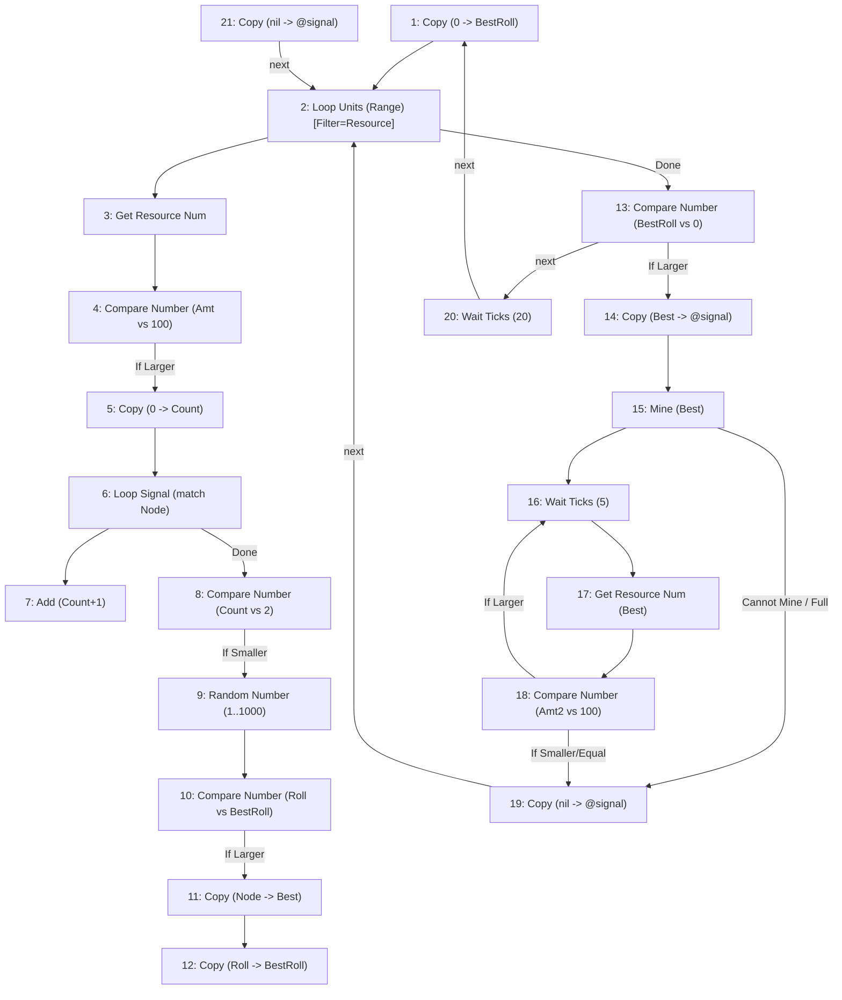

# Blight Magnifier / Overclock Economics and a Coordinated Miner-Drone Design

A worked-out design doc covering two things built in the same session: (1) the
real math behind overclock modules, building base efficiency, and the
oversized-socket bonus, applied to picking building layouts for Blight
Magnifiers; (2) a full drone-mining behavior — reservoir-sampled node
selection, Signal-register-based coordination to avoid oversubscribing one
node, and a corrected understanding of what the native engine already does
for you — written directly in `behavior_source_format.md`'s graph grammar as
a real test of that format's usability for original authoring, not just
decompiling.

## Part 1: Component efficiency math

### The core formula

Confirmed directly in `get_work_time` (`data/components.lua:7405-7416`), the
only Lua-visible implementation of this — used by Blight Extractor and Blight
Magnifier specifically, since both are "self-timed work" components rather
than generic recipe-driven producers:

```
eff_boost = frame.component_boost (the building's own intrinsic bonus)
          + sum of every c_moduleefficiency-family component's `boost`,
            any size, anywhere on the building (additive, confirmed via
            SumModuleBoosts, utilities.lua:584)
          + faction.component_boost - 100 (Re-Simulator global bonus, usually 0)
          + 50  if this specific component sits in a socket LARGER than its
                own attachment_size, else 0 (flat, not scaled by how much
                bigger — Medium-in-Large and Small-in-Large both just get +50)

speed multiplier = (100 + eff_boost) / 100
```

Overclock modules (`c_moduleefficiency*`, `components.lua:357-396`) come in
four sizes — Internal +20%, Small +50%, Medium +100%, Large +150% — cost no
power, and their effect is building-wide, not confined to their own socket.
Every building has 2-4 Internal sockets (confirmed via `data/visuals.lua`
socket lists) that never compete with production-component placement, so
filling them with Internal Overclock Modules is close to a free lunch.

**Socket size ordering** (`ui/utilities.lua:197-199`,
`attachment_sizenums`): Internal=1, Small=2, Medium=3, Large=4. A socket
accepts any component of its own size or smaller; the +50 oversocket bonus
only fires when the *component* is smaller than the *socket* it's actually
placed in.

### The mistake made and corrected: opportunity cost is not always 100pp

Early in this analysis a shortcut formula was used — "sacrificing one
Medium/Large slot for an Overclock Module instead of a magnifier always costs
exactly 100 percentage points, regardless of socket size" — derived from the
fact that Large-OC (150%) minus Medium-OC (100%) exactly equals the
oversocket bonus (50%). **This shortcut is only true when there is exactly
one magnifier in the building.** With two or more magnifiers, it breaks,
because the +50 oversocket bonus is *per-component* (only the one magnifier
literally sitting in the Large socket gets it) while an Overclock Module's
boost is *shared building-wide* (every magnifier benefits equally). Spreading
one Large socket's +150% across several magnifiers beats letting one of them
keep a private +50%, once there's more than one magnifier to spread it over.

The concrete case this bit: for `f_building3x2a` ("Building 3x2, 1L3M"), the
shortcut predicted an all-4-magnifier configuration would win (13.20x). The
correct per-slot brute-force enumeration (every Medium/Large socket
independently either "magnifier" or "Overclock-of-its-max-size", summing each
magnifier's own `eff_boost` including its own personal oversocket bonus if
applicable) gives the real optimum: **3 magnifiers + 1 Large Overclock =
12.90x**, beating all-4-magnifiers' **11.70x**. The lesson generalizes:
*any* building with a Large socket and 2+ magnifiers needs brute-force
per-slot enumeration, not a shortcut — the Large socket should hold an
Overclock Module whenever more than one magnifier is in play, never a
magnifier itself.

### Corrected building table

One earlier mistake in identifying buildings, worth stating plainly since it
propagated through an entire round of math before being caught: **the
building named "Building 2x1 (1M)" (`f_building2x1d`, 100% intrinsic boost)
is a 2-tile building** (`v_base2x1d`'s `tile_size = {1, 2}`), not a 1-tile
building — it was mislabeled as "1x1" for a few iterations by conflating it
with the *separate*, unrelated 1-tile `f_building1x1a` ("Building 1x1 (1M)",
0% boost) and `f_building1x1h` ("Defense Block", 50% boost, also 1 tile).
Always check `tile_size` in the frame's `visual` entry directly — the name
suffix ("1x1"/"2x1"/"2x2"/"3x2") is normally reliable but a frame's *actual*
footprint is only confirmed by its visual def.

Per-tile throughput (`output × (cellsize - footprint) / (200 × cellsize)`,
where `cellsize = (w+4)(h+4)` is the gapless-tiling cell for Chebyshev range 2
— see "Range is Chebyshev distance" below) for the best-total-output
configuration of each real building layout:

| Building | Footprint | Best-total output | Throughput/total-land |
|---|---|---|---|
| **3x2 (1L3M) — `f_building3x2a`** | 6 (3×2) | 12.90 (3 mag + 1 Large OC) | **0.0553** |
| 2x2 (2M1L) [C/D] — `f_building2x2c` | 4 | 7.20 (2 mag + 1 Large OC) | 0.032 |
| 2x2 (2M1L) [A] | 4 | 6.80 | 0.0302 |
| 2x2 (3M) — `f_building2x2b` | 4 | 6.30 (3 mag) | 0.028 |
| 3x2 (2M2S) | 6 | 5.20 (2 mag) | 0.0223 |
| 2x2 (1M3S) | 4 | 3.60 (1 mag, forced) | 0.016 |
| 2x1 (2M) — `f_building2x1c` | 2 | 4.00 (2 mag) | 0.0187 |
| 2x1 (1M1L) | 2 | 3.30 (2 mag, best split) | 0.0154 |
| 2x1 (2S1M) | 2 | 2.90 (1 mag, forced) | 0.0135 |
| 2x1 (1M) — `f_building2x1d` | 2 | 2.40 (1 mag, forced) | 0.0112 |
| 1x1 (1L) — `f_building1x1b` | 1 | 1.90 (1 mag, personal oversocket) | 0.0091 |
| Defense Block — `f_building1x1h` | 1 | 1.70 | 0.0082 |
| 1x1 (1M) — `f_building1x1a` | 1 | 1.40 | 0.0067 |

The small 1-tile buildings are the *worst* choice by true land-throughput,
despite having the best coverage-area-to-footprint ratio — their magnifier
density is too thin to make up for it. **`f_building3x2a` is the best
building for this purpose, full stop** — both for raw total output and for
throughput per unit of land, because its 100% intrinsic boost and 4 Internal
sockets more than compensate for its worse area-to-footprint ratio.

### Range is Chebyshev distance, confirmed in-game

User-confirmed: Magnifier `range = 2` means a square region extending 2
tiles in *every* direction from the building's footprint (a 5×5 square
centered on a 1×1 building) — Chebyshev/king-move distance, not Euclidean. A
useful consequence: Chebyshev-range squares tile the plane with **zero gaps
and zero overlap** when buildings are spaced exactly `(footprint + 2×range)`
apart on a grid, unlike circular (Euclidean) coverage, which would need
either gaps or overlap. For `f_building3x2a` (3×2 footprint), that's a 7×6
tiling cell — 6 tiles for the building, 36 for resource nodes, fully
covered, no waste.

### TICKS_PER_SECOND = 5

User-confirmed as a stable engine constant, unlikely to ever change (many
things would break). Not found in Lua source (native constant, same category
as `REG_INFINITE`). Cancels out of any ratio comparing two tick-based rates
(e.g. magnifier regen supply vs. mining demand), so it mattered less than
initially assumed for the throughput math above — it matters for converting
to real seconds, not for the relative comparisons.

## Part 2: Miner-drone behavior design

### Native mechanics confirmed this session (source-cited, several corrected mid-session)

- **Mining recipe rates** (`data/items.lua:661-673`, `blight_crystal`):
  `c_miner` = 50 ticks/unit, `c_adv_miner` = 25 ticks/unit (Advanced Miner
  Drone is 2x faster) — always prefer the Advanced Miner Drone. Stack size
  20.
- **A resource node mined to exactly 0 can never be revived.**
  `AddResourceHarvestItemAmount` (`utilities.lua:575-582`, its own comment:
  `-- make sure result is > 0!!`) guards on `num > 0` before adding anything
  — once a node's remaining register hits 0, the Magnifier's regen call
  silently no-ops forever. This is why a "never mine below a floor" behavior
  isn't just an optimization, it's what keeps the node alive at all.
- **`c_behavior` (Behavior Controller) is an ordinary Internal-sized
  component** (`components.lua:3883-3889`, *"Additional small, low-powered
  programmable device. Can be added to units and buildings without an
  integrated behavior controller"*), not something exclusive to "robot" race
  frames with an intrinsic slot. Any frame with a free Internal socket — the
  Miner Drone and Advanced Miner Drone both have 2 (`visuals.lua:557-577`,
  their `c_miner`/`c_adv_miner` is marked `"hidden"` and doesn't consume a
  socket) — gets the full visual Program editor by socketing one in.
- **`drone_range` only gates the native, automatic port-side job-dispatch
  system, not a Program-controlled unit.** `c_miner:on_update`'s own
  auto-target search (`components.lua:2351`) uses
  `owner.has_movement and owner.visibility_range or miner_range` —
  `drone_range` never appears in it at all. A drone with its own Behavior
  Controller isn't leashed to its port's range; it's bounded by whatever its
  own Program does.
- **The store register auto-delivers cargo with no range limit at all**, and
  — the refinement added late in this session — **it automatically resumes
  the previous mining target once storage completes, and kicks in whenever
  nothing else is actively controlling the unit**, including with *no*
  Program installed at all (confirmed: manually setting the mine-target and
  store-target registers via the UI, unconnected to any logistics network,
  is sufficient for a perpetual mine → go-store-when-full →
  auto-resume-same-target cycle with zero scripting). This meant an earlier
  draft of the mining sub-loop (which re-invoked the `mine` instruction every
  recheck cycle) was doing unnecessary work — `mine` only needs to be called
  once, to establish the target; after that the native cycle runs itself,
  and the Program's only remaining job is periodically checking whether the
  live remaining amount has crossed the 100-unit floor, at which point it
  should switch targets.
- **Drone-holding components (`c_drone_port`, `c_drone_comp`, etc.) can be
  nested inside other moving units** — user-confirmed working in-game,
  correcting an earlier guess (based on there being no Lua-visible precedent
  for a mobile anchor point) that this might not function correctly.
- **Drones can be produced by a plain Robotics Factory**, not only by
  drone-port-family components — `c_robotics_factory = 100` is already
  listed as an equally-valid crafting station in both `f_drone_miner_a`'s and
  `f_drone_adv_miner`'s `production_recipe` (`frames.lua:1883`, `1903`),
  alongside `c_drone_port`/`c_drone_comp`/`c_drone_launcher`. Nothing about
  the drone-mining design requires building anything port-shaped at all.
- **A resource node's own registers cannot be written to from a Program.**
  The only remote-write instruction, `set_reg_remotely`
  (`instructions.lua:6849`), gates through `GetAdjacentFactionEntityOrSelf`
  (`instructions.lua:302-316`), which requires the target to be same-faction
  (a neutral resource node never qualifies) *and* physically touching
  (unless the caller is specifically an AutoBase controller, which gets a
  same-logistics-network exception instead). This ruled out an earlier idea
  of marking a node "claimed" by writing directly to it — that capability
  only exists in the engine's own native Lua (e.g. the Magnifier's
  `entity:SetRegisterNum(...)` calls), not in the player-facing instruction
  set. Reading an arbitrary entity's data (e.g. `Get Resource Num`) has no
  such restriction — only *writing* to something you don't own is gated.
  Writing to your *own* other components (`set_comp_reg`, "Set to
  Component") is unrestricted, since it never takes a target-entity argument
  at all — it only ever resolves against `comp.owner`.
- **`FRAMEREG_SIGNAL` + `faction:GetEntitiesWithRegister` is a real,
  purpose-built, faction-wide (no range limit at all) coordination
  mechanism**, exposed via the `Loop Signal` instruction
  (`for_signal_match`, `instructions.lua:2417-2508`) — exactly the
  "broadcast which node I'm working on, let others check for oversubscription"
  mechanism this design needed, once the direct-node-write idea above was
  ruled out. A drone writes its own Signal register to `{entity =
  target_node}` (a write to itself, always legal); any other drone runs
  `Loop Signal` with that same entity as the query and gets every faction
  unit (anywhere on the map) currently signaling it, with a simple iteration
  count deciding "already oversubscribed."
- **`mine` does not itself block the calling behavior.** Its `func`
  (`instructions.lua:5547-5651`) falls through without `SetStateSleep`/
  `return true` on the happy path; movement/mining progress is driven
  entirely by `c_miner`'s own separate on_update cycle. What *does* throttle
  execution is the per-tick dispatcher itself
  (`c_behavior:on_update`, `components.lua:4027-4090`): a "locked" behavior
  (`state.limit or 1`) runs exactly one instruction per tick regardless,
  which naturally paces a `mine → check → loop` cycle correctly. An
  "Unlocked" behavior has no such throttle — the same loop would spin
  uselessly fast, seeing an unchanged value every iteration (mining doesn't
  advance within the instruction dispatch itself), and would hit
  `"Unlocked behavior exceeded instruction limit for a single step"`. An
  explicit `wait` between establishing the mine target and rechecking it is
  correct insurance regardless of lock state, not just an unlocked-mode fix.
- **`mine`'s real value over driving the miner's register directly**: it
  bundles four decisions as explicit branches your Program can react to
  (path blocked → `Cannot Mine`; unpowered → `Cannot Mine`; already carrying
  the requested amount → `Full`; no cargo space → `Full`) that a raw
  register write (via a Link Editor wire or `set_comp_reg`) does not surface
  to your own instruction flow — the underlying component still behaves
  sensibly either way, but only `mine` tells *you* about it. It also applies
  to every `c_miner` component on the entity at once and avoids redundant
  register writes via its own before/after comparison.
- **"Loop Nearby Resources" (`for_count_resources`) aggregates by resource
  *type*** (total amount summed across all matching nodes in range), **not
  per individual node** — the wrong instruction for candidate-by-candidate
  scanning, a mistake made mid-session while first describing this design in
  prose and only caught once actually building the graph (see below). The
  correct per-entity iterator is **"Loop Units (Range)"**
  (`for_entities_in_range`, `instructions.lua:869-897`) with
  `Filter=v_resource`.

### The MinerDrone behavior (graph source format)

Final, corrected form, per `behavior_source_format.md`'s grammar. Algorithm:
loop nearby resource nodes via reservoir sampling (candidates must be >100
remaining and not oversubscribed per `Loop Signal`), commit to the winner via
Signal broadcast, call `mine` once, then just wait-and-recheck (relying on
native auto-store/auto-resume) until the node drops to the 100 floor, then
release the claim and restart.

```
behavior MinerDrone():
  desc: "Reservoir-sample a resource node above the 100-unit floor, avoid oversubscribed nodes via Signal broadcast, mine down to the floor, repeat"

1: set_reg(Value=0, Target=$BestRoll)
2: for_entities_in_range(Range=5, Filter=v_resource, Unit=$Node) >13 (Done)
3: get_resource_num(Resource=$Node, Result=$Amt)
4: check_number(Value=$Amt, Compare=100) >5 (If Larger) >STOP (If Smaller) >STOP (next)
5: set_reg(Value=0, Target=$Count)
6: for_signal_match(Signal=$Node, Unit=$SigUnit) >8 (Done)
7: add(To=$Count, Num=1, Result=$Count) >STOP (next)
8: check_number(Value=$Count, Compare=2) >STOP (If Larger) >9 (If Smaller) >STOP (next)
9: random_number(Min=1, Max=1000, Result=$Roll)
10: check_number(Value=$Roll, Compare=$BestRoll) >11 (If Larger) >STOP (If Smaller) >STOP (next)
11: set_reg(Value=$Node, Target=$Best)
12: set_reg(Value=$Roll, Target=$BestRoll) >STOP (next)
13: check_number(Value=$BestRoll, Compare=0) >14 (If Larger) >STOP (If Smaller) >20 (next)
14: set_reg(Value=$Best, Target=@signal)
15: mine(Resource=$Best) >19 (Cannot Mine) >19 (Full)
16: wait(Time=5)
17: get_resource_num(Resource=$Best, Result=$Amt2)
18: check_number(Value=$Amt2, Compare=100) >16 (If Larger) >19 (If Smaller) >19 (next)
19: set_reg(Value=nil, Target=@signal) >21 (next)
20: wait(Time=20) >1 (next)
21: set_reg(Value=nil, Target=@signal) >2 (next)
```

Notes on the wiring:
- **4**: strictly `>100` — `If Smaller` and the `Equal` fallthrough both
  reject via `STOP`, which (per the loop semantics in
  `behavior_source_format.md`) pops back into the enclosing
  `for_entities_in_range` and advances to the next candidate — the intended
  meaning of a `STOP` reached inside a loop's dynamic scope, not a bug.
- **6-8**: oversubscription check — cap of 2 total claimants is a tunable
  design choice, not a derived constant.
- **9-12**: the actual reservoir-sampling step.
- **13**: `$BestRoll` starts at 0 and a real roll is always ≥1, so `==0`
  unambiguously means "nothing survived the loop."
- **15-18**: relies on the confirmed native auto-store/auto-resume behavior
  — `mine` is called exactly once to set the target; the loop from 16
  onward only monitors the live amount and never re-touches the miner's
  register while the target is unchanged.
- **19, 20, 21** are three separate entry points into the same
  reset-and-restart logic, left unmerged in this draft — a real, minor,
  acknowledged inefficiency (see "Known gaps" below), and exactly the kind
  of bookkeeping a real parser/renderer should handle mechanically rather
  than by hand.

Rendered as Mermaid (STOP edges omitted, matching
`scripts/render_examples.py`'s actual `to_mermaid` convention — real,
present in the listing above, just nothing for the diagram to draw an arrow
to):



### Known gaps / not yet done

- **Not compiled or validated against real Lua** — this is hand-authored
  directly against `behavior_source_format.md`'s grammar, the way a human
  would write source code, not run through `interpreter.py` or round-tripped
  through `dcs_wire.py`. The reverse direction (parsing this text format back
  into a real instruction table) doesn't exist yet, per
  `behavior_source_format.md`'s own "Status" section — this doc predates
  that tooling being built, and should be one of its first real test cases
  once it exists.
- **Instructions 19-21 are redundant** (three separate reset-and-restart
  entry points that could collapse to one or two) — caught by direct user
  review, not fixed in this draft. Left as-is deliberately, as a concrete
  example of the kind of bookkeeping error that's easy to make by hand and
  should be mechanically checked by real tooling.
- **Not yet integrated with an outer building-selection/travel routine.**
  This behavior handles "given you're already in a good area, pick and mine
  nodes there" — it does not yet handle *which* area to travel to in the
  first place. The intended integration point (per direct user design
  discussion): a building-side Signal broadcast ("I have nodes >100 nearby"),
  drones randomly pick among currently-signaling buildings, travel there,
  and only then run this procedure — with instruction 13's "no candidate"
  path and the reset-and-restart tail (19/21) re-routed to that outer
  loop's "check inventory / wait for store delivery / pick a building /
  travel" logic instead of just looping locally. Not built yet.
- **The oversubscription cap (2) and floor (100) are both hardcoded design
  choices**, not derived constants — reasonable starting points, worth
  tuning empirically once this runs for real.

## What this exercise demonstrated about the toolset itself

This was a deliberate test (the user's explicit framing) of whether Claude
Code can author — not just decompile — a real behavior directly in
`behavior_source_format.md`'s grammar from a natural-language design
discussion, using only `instructions_index.md` + the format spec + targeted
source reads, no existing `.dcs` file as a starting point.

- **Where it worked well**: every instruction name, pin, and semantic
  gotcha needed (the equality-fallthrough idiom, `for_signal_match`'s
  entity-vs-id matching, the loop-dead-end-pops-the-stack rule) came from
  material already read this session or grep'd in seconds — assembling a
  21-instruction graph took no new deep-dive beyond double-checking two
  argument names.
- **Where it caught a real mistake**: writing the actual graph (not just
  describing the plan in prose) is what surfaced the "Loop Nearby Resources"
  vs. "Loop Units (Range)" mixup — a wrong instruction reference that had
  gone unnoticed through several turns of prose description. Concreteness
  forces errors out; a prose plan can hide a wrong instruction reference
  indefinitely.
- **Where it's still fragile**: instruction-index bookkeeping (tracking
  which edges are implicit-adjacent-fallthrough vs. need an explicit
  branch note) was done entirely by hand here. Manageable at 21
  instructions, would get error-prone well before real corpus behaviors'
  typical size — exactly why `behavior_source_format.md` flags the
  parse-back direction as the next real piece of infrastructure needed, not
  a nice-to-have.
- **Reinforces [[feedback_verify_engine_semantics_ingame]] repeatedly, in
  both directions**: several corrections this session came from the user's
  own in-game/gameplay knowledge overriding what static Lua reading alone
  suggested (store-register auto-resume, drone-port nesting working,
  Program-driven units not being bound by `drone_range`) — but at least one
  correction went the other way, with a specific source-code check (`mine`'s
  actual `func`, the dispatcher's `step_limit`) resolving a question neither
  party could have answered from gameplay intuition alone. Both directions
  matter; neither in-game experience nor source-reading alone is
  sufficient on its own.
